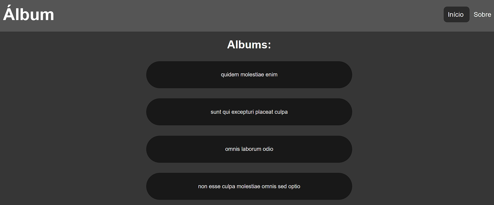

<h1 align="center"> <a href="https://praticando-react-router-e-axios-qqjw2k35s.vercel.app/"> Praticando React Router e API </a></h1>

 

<h3 align='center'> Projeto realizado para praticar conceitos do React, React Router, API, Axios API e Custom Hook. </h3>

 

---------------------------------------

  <h2>Imagem do projeto:</h2>
  

 

  <h2>Tecnologias usadas:</h2>
   -
   -
   -
  
  
    

  ## <a href = "https://praticando-react-router-e-axios-qqjw2k35s.vercel.app/"> Veja o projeto aqui. </a>

